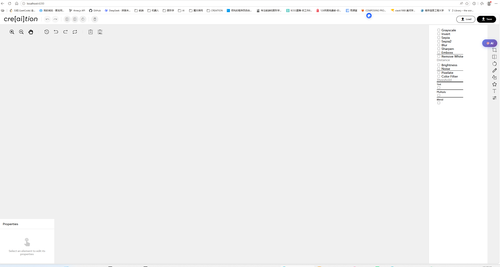
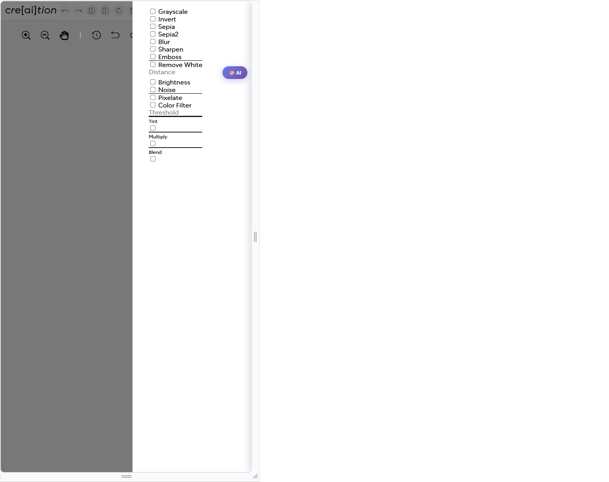

- Setup instructions
  Go to apps/angular-mage-editor directory and run the following commands:

```bash
pnpm install
ng serve
```

- API configuration steps
  AI helped me to configure the API.
- Features implemented

1. Image upload and preview
2. Image editing tools
3. Image filters
4. AI generated images

- Design decisions made

1. User interface design
2. User experience design

- Any challenges faced

google image api does not work as expected. (they have banned the free tier in mainland China), and huggingface api reported a 404 when invoking, worked hard to find a usable API. (Only the below two models can both be accessed from huggingface, and at the sametime support text-to-image generation)

```javascript
const MODELS = {
  sd3medium: 'stabilityai/stable-diffusion-3-medium-diffusers',
  flux: 'black-forest-labs/FLUX.1-schnell'
};
```

)

This is the desktop version



And this is the mobile version (the submenus are modal)



Things left TODO:

1. when opened in very small screen a relatively large picture, the right controls cannot be clicked. --fixed
2. when opened in very small screen, the picture lies on the bottom of screen and cannot show full size. --fixed

